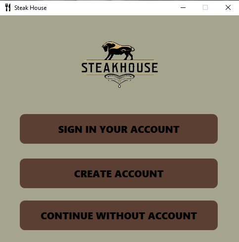
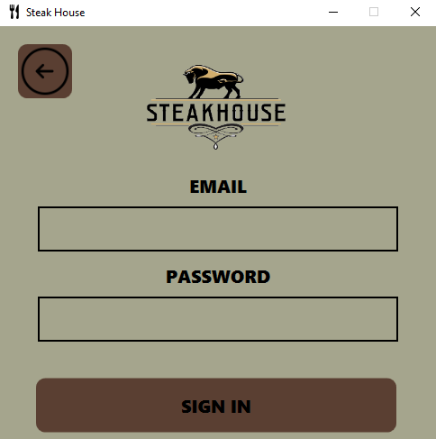
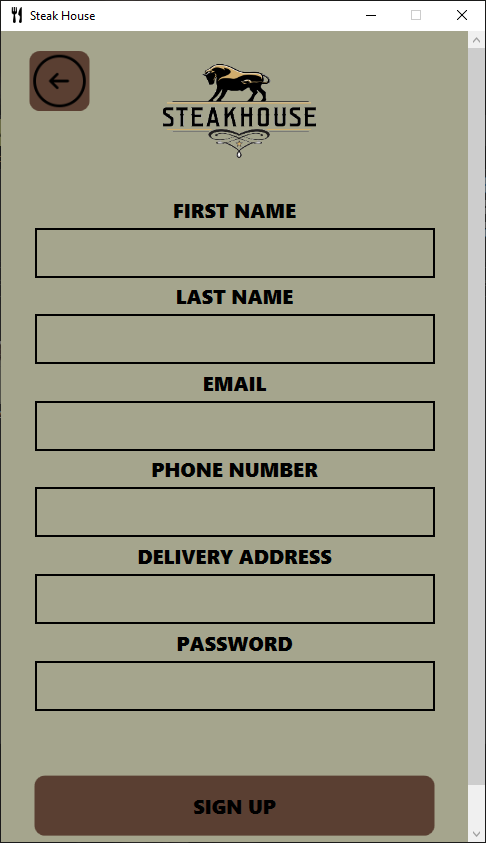
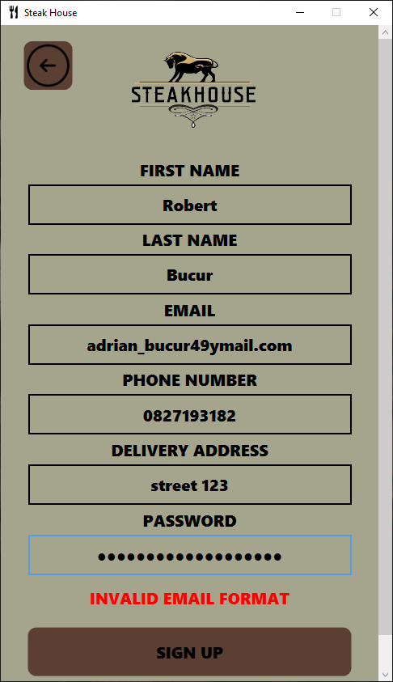
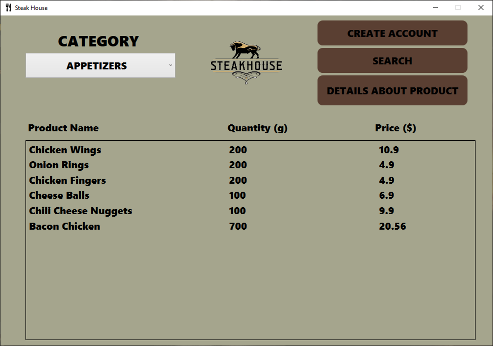
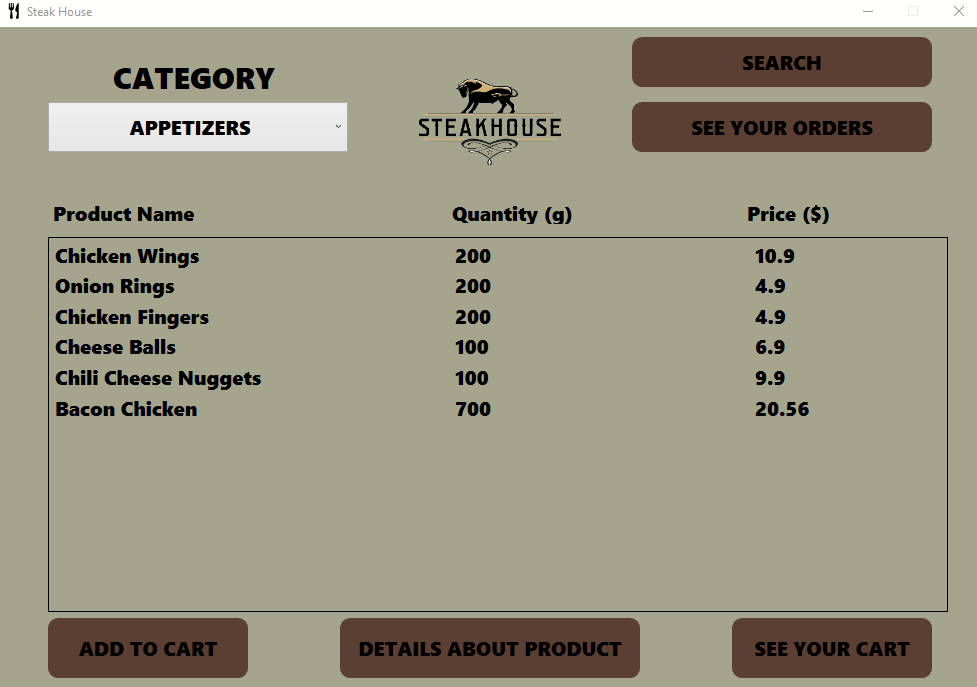
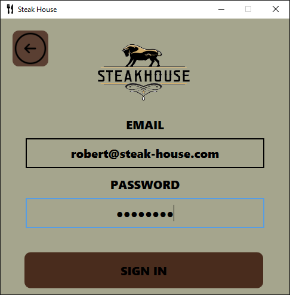
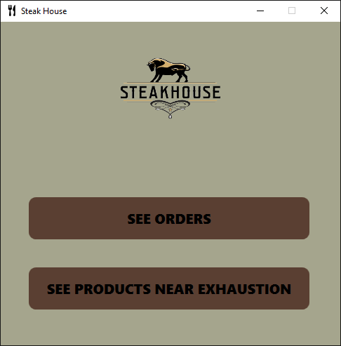
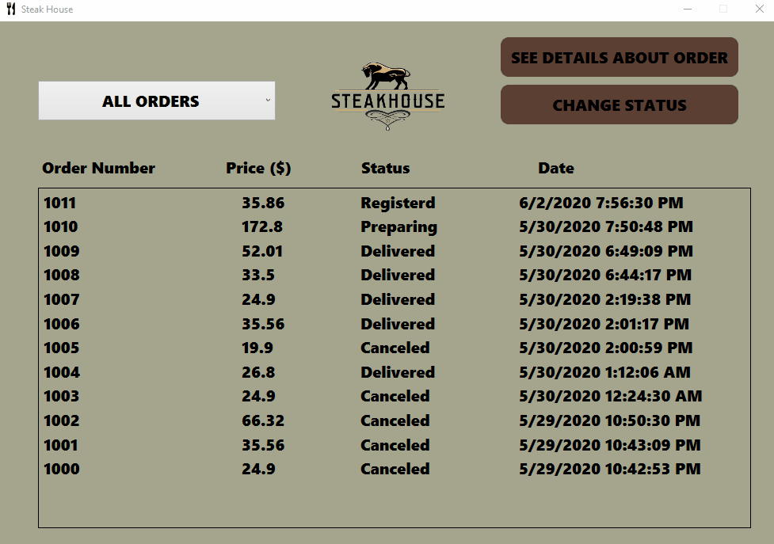

# Restaurant

**This application represents a management system for a restaurant**

- __This project is an implementation in C# using WPF in Visual Studio.__
- __I created this application as part of the Visual Programming Enviroments' laboratories at the university.__
- __This app is structured on the Model-View-ViewModel architecture.__
- __The app connects to a database made in SQL Server.__
- __For connecting to database I used EntityFramework - some of the queries are stored procedures and the rest are written using LINQ.__

## Authentication

__From home page the user can choose to login, to create an account or to see the menu without an account and then if is interested to order something he can create an account.__

|  |  |
|:---:|:---:|
|  |  |

__When creating an account the content which the user fills in is verified to be in a correct format - for example the email must contain the special characters `@` , `.` and some text before, between, and after them.__

## Menu & Orders

__The menu looks like this for a customer that doesn't have an account. From here he can see the menu by category, create an account, search products by some criteria, and see more details about a selected item.__

|  |  |
|:---:|:---:|
|  |  |

__Those who have an account can place an order and see their cart, from where they can delete a previously added product. Also the user who is registered can see his order history.__

## Employee section

__The app has a section for employees which can be accessed by them logging in using their special email address which ends in `@steak-house.com`. Inside this section the employee can see all the orders in descending order by date and they also can see the products that are near exhaustion grouped by category.__

|  |  |
|:---:|:---:|

__In orders view the employee can see all orders sorted descending by date. From the drop-down menu he can choose `ACTIVE ORDERS` and so the status of an order can be changed to `PREPARING`, `LEFT`, or `DELIVERED`. When pressing `SEE DETAILS ABOUT ORDER` button - only after an order is selected - he can see details about it, such as the user who placed it, the products he ordered, total price, and how many pieces of each product.__

__The employee can also see products near exhaustion - products that have a total quantity in store less than or equals to `1000g` grouped by category.__

|  |  |
|:---:|:---:|
